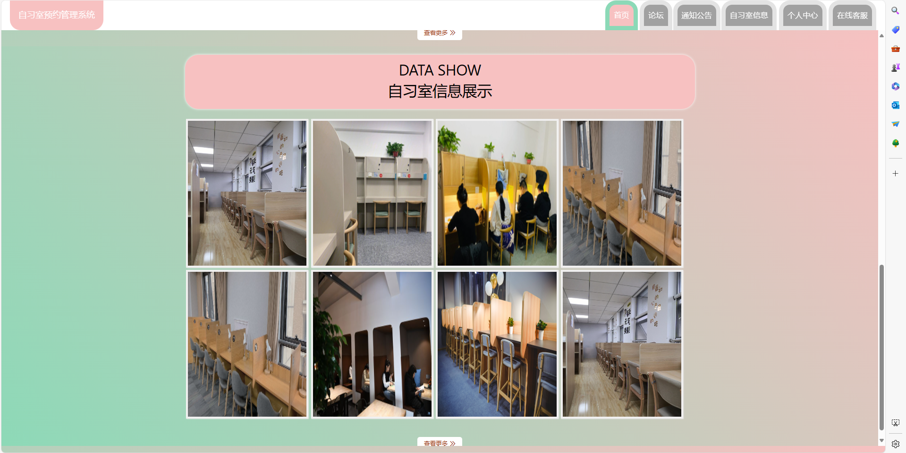
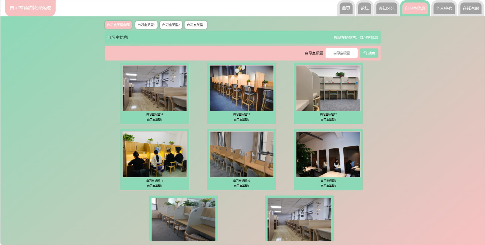
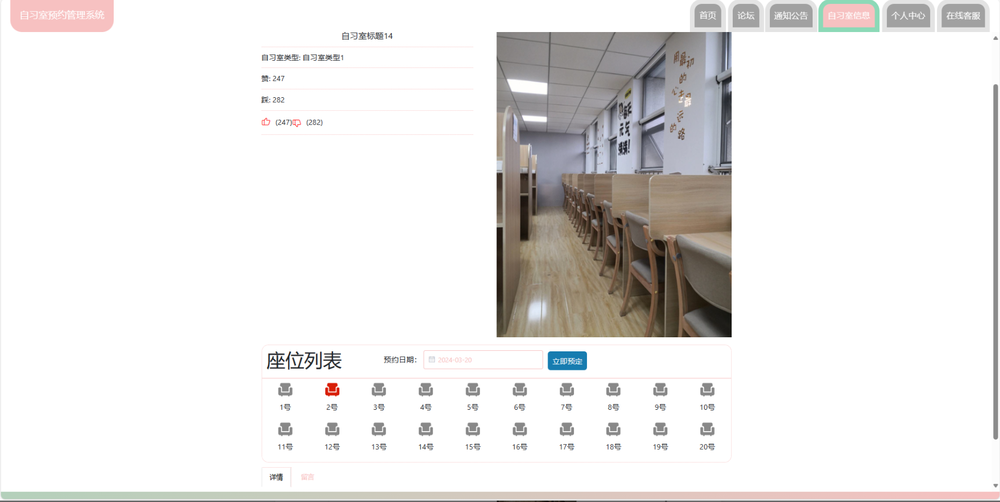
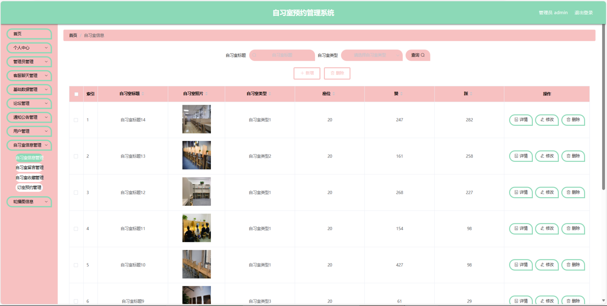
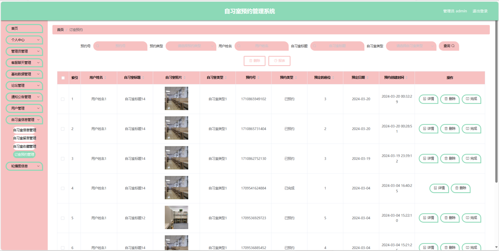
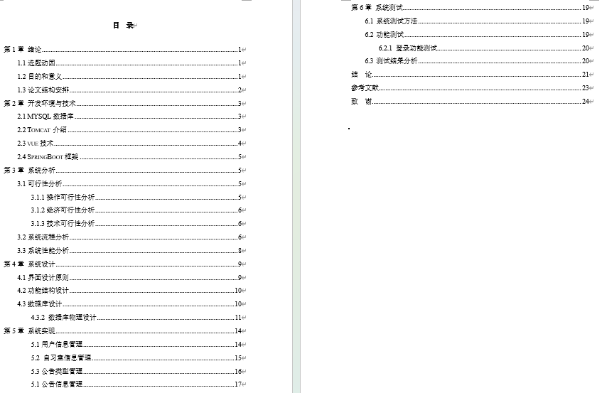
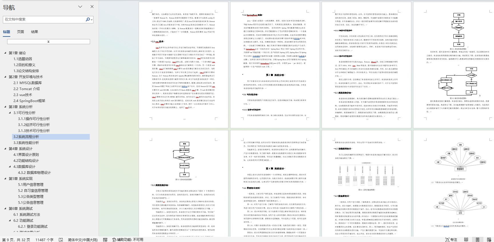

# 自习室预约管理系统

### 9.9￥ 获取完整源码+sql，附赠11000字论文参考，需要的加Q：3808981644 微信：qszard26
### 有问题，或者需要协助调试运行项目的也可联系

## 一、介绍

基于springboot+vue的前后端分离自习室预约管理系统

开发语言：java

运行环境:idea或eclipse 数据库:mysql

主要技术:
Java,Springboot,mybatis,mysql,jquery,html,vue

角色:用户、管理员

用户菜单:首页:个人中心,论坛,通知公告,自习室信息,自习室座位预约，个人中心,在线客服

管理员菜单:首页,个人中心,管理员管理,客服聊天管理,
基础数据管理:公告类型管理,自习室类型管理
通知公告管理,用户管理
自习室信息管理:自习室信息管理,自习室留言管理,自习室收藏管理,订座订单管理
轮播图信息

## 二、部分页面截图展示

## 三、11000字论文参考

### 9.9￥ 获取完整源码+sql，附赠11000字论文参考，需要的加Q：3808981644 微信：qszard26
### 有问题，或者需要协助调试运行项目的也可联系

